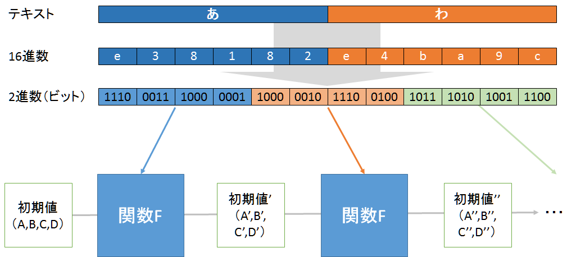

<!-- $theme: gaia -->

 
ハッシュって何？
==

神戸デジタル・ラボ 
長山哲也

<!-- page_number: true -->

---
# あなた誰？
## セキュリティコンサルタント
## Python好き
## DJ/トラックメイカー
## @Euphoricwavism
---
# 勉強会の狙い
- セキュリティ的な話
ハッシュ関数と暗号化理論は複雑でわかりにくいことを理解してもらう。推奨暗号化方式を利用すべきだという感覚を持ってもらう。

- Python的な話  
PythonにMD5のライブラリあって良かった

---
# ハッシュ関数とは
ある値に対して一定の長さの情報量を返す関数
ハッシュの意味：ぐちゃぐちゃにする、細切れにする

---
# ハッシュ関数の特性
- 決定性：ある入力値に対するハッシュは常に同じ
- 一様性：入力値に対するハッシュは一様に分布

---
# セキュリティでの利用用途

- 完全性の確保：改ざんされたかチェックできる
- 機密性の確保：漏洩しても元の値が盗まれるまでの時間を稼げる

---
## 暗号学的ハッシュ関数に必要な要件
- 原像計算困難性  
ハッシュ値から元の値が計算できないこと。一方向であること。  
- 弱衝突耐性
ある入力値に対して出力したハッシュ値と同じ値になる別の入力値を得ることが困難であること。
- 強衝突耐性
入力値群Aでそれぞれ出力したハッシュ値と入力値群Bでそれぞれ出力したハッシュ値を比べた際に衝突が起きにくいこと。

---
## MD5とは

- 10年前までは主力の暗号学的ハッシュ関数
- アルゴリズム：MD構造（Merkle-Damgård構造）

---
## 今回やること：MD5の実装

- 全てこの時間内にやるのは無理
- 答えを用意してあるので、写経していくことで少しでも理解してもらう。
- 全部写すのは嫌という人のために基礎だけ用意したのもある

---
## MD5の特性
- 原像計算困難性の確保：AND、OR、XOR等を混ぜることによって元の値が計算できないようになっている
- 弱衝突耐性、強衝突耐性の確保：ハッシュ値のビット長を長くする（128bit）ことで計算量を多くし、耐えられるようにしている

---
# 実装タイム

---
# 10年間までは主力だった

- MD5は使わない方がいい。
	- 今すぐに壊滅的な被害がでるわけではないが、何年か後には分析されてしまう可能性がある。
	- 一度ハッシュ関数を利用しだすと同じシステムで異なるハッシュ関数に変更することが難しい
	- 世間体もある（あんまり理解してない人けどセキュリティに興味ある人がMD5使ってるとうるさく言う人がいる）
---
# FAQ
- 現在は、逆変換できる？
	- できません。
- WebアプリケーションでMD5使ってもいい？
	- 正直ハッシュ関数のアルゴリズムに寄らないところの脆弱性を利用されて被害を受けるケースが一般的なので、単純にSHA-2を使えばいいというわけではない。
	- ただし、前述の通りなので推奨されているSHA-2を使うに越したことはない。

---
# まとめ
## MD5は複雑、実装も大変
## 暗号化理論も複雑でわかりにくい
## 政府の推奨暗号を使いましょう

---
# ありがとうございました
